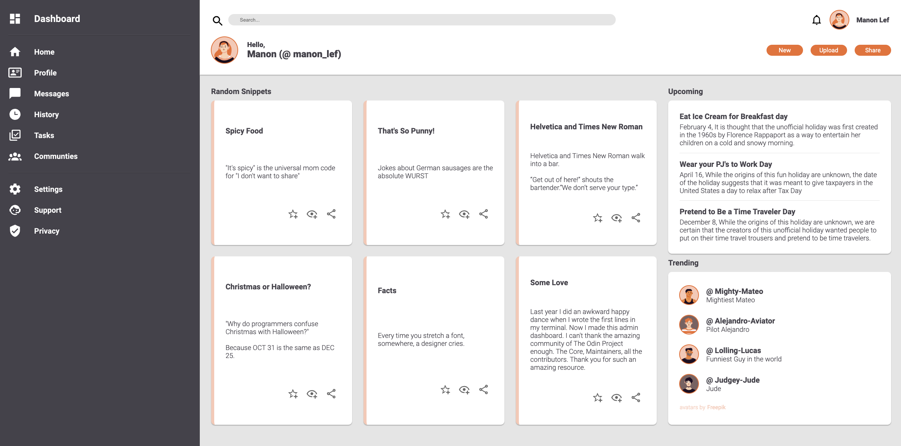

# Admin Dashboard

## Result
[See the Admin Dashboard Live here](https://manonlef.github.io/Admin-Dashboard/)

## About this project
This project is intended to put in practice your CSS Grid skills. The Layout should mostly lean on grid.

## Objective
- [x] Make a layout similar to the provided design file

## Notes and lessons learned
- This is one of the first project I didn't fully draw out like I did with the flex projects. Seeing the design file I felt confident enough to start with the 3 main sections. I found the possibility to nest grids into other grid cells a very modular way of working which also felt way more flexible (no pun intended) compared to flexbox.
- The project went smoothly. The exercises leading up to this project really were very representative of what we'd encounter here. This project just had a lot more nesting because of all the elements in it.
- I could have planned out the classes better perhaps. That would probably have saved me some lines of CSS.
- I had to use filters for the SVG's since I downloaded them as images and didn't embed the actual SVG code. 

## Things to add or improve when revisiting this project
- [ ] refactor the dashboard, buttons and other elements into clickable links
- [ ] make a collapsible menu from the sidebar
- [ ] change the img SVG's to embedded SVG for more control regarding color
- [ ] make it mobile friendly

## Credits
- avatars from Freepik (link on the live site)
- icons from [pictogrammers.com](https://materialdesignicons.com/)
- font Roboto by [Christian Robertson](https://fonts.google.com/?query=Christian%20Robertson)